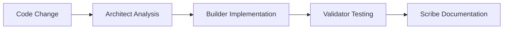
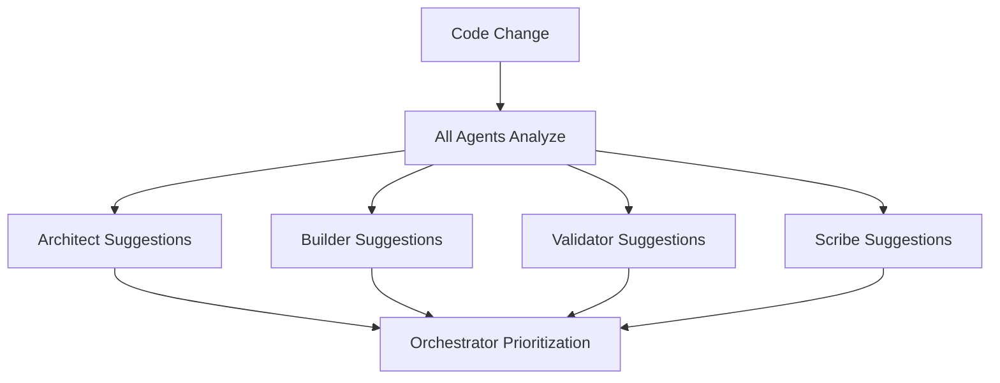
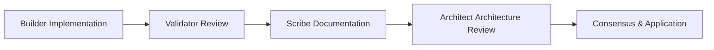

# Mech-Evolve Agent Architecture Guide

## Agent System Overview

The mech-evolve system employs four specialized AI agents that work together to continuously improve your codebase. Each agent has distinct responsibilities, triggers, and outputs, creating a comprehensive improvement ecosystem.

## Agent Specializations

### 🏗️ Architect Agent
**Mission**: System design, architectural patterns, and strategic planning

#### Core Responsibilities
- **Project Structure Analysis**: Evaluate folder organization, module boundaries, and architectural patterns
- **Design Pattern Recognition**: Identify and suggest appropriate design patterns (MVC, Repository, Factory, etc.)
- **Technology Stack Optimization**: Recommend technology upgrades, library choices, and framework improvements
- **Code Organization**: Suggest better file structures, module separation, and dependency management
- **Performance Architecture**: Identify architectural bottlenecks and scalability issues

#### What Triggers the Architect Agent
```javascript
// File-based triggers:
- package.json modifications
- tsconfig.json / configuration changes
- New directory structure creation
- Major refactoring across multiple files
- Infrastructure-related files (Docker, CI/CD)

// Pattern-based triggers:
- Architectural anti-patterns detected
- Circular dependencies found
- Violation of SOLID principles
- Monolith complexity threshold exceeded
```

#### Architect Agent Outputs
```javascript
{
  "agent": "architect",
  "analysisType": "architectural_review",
  "findings": {
    "violations": [
      "Tight coupling between service layer and database",
      "Missing abstraction for external API calls",
      "Violation of Single Responsibility Principle in UserController"
    ],
    "opportunities": [
      "Extract authentication logic into middleware",
      "Implement Repository pattern for data access",
      "Add dependency injection container"
    ]
  },
  "recommendations": [
    {
      "priority": 8,
      "type": "architectural",
      "title": "Implement Repository Pattern",
      "description": "Extract database operations into repository classes",
      "impact": "Improves testability and separation of concerns",
      "effort": "medium",
      "files": ["/models/", "/services/", "/repositories/"],
      "implementation": {
        "steps": [
          "Create IUserRepository interface",
          "Implement UserRepository class", 
          "Update UserService to use repository",
          "Add repository dependency injection"
        ]
      }
    }
  ]
}
```

### 🔨 Builder Agent
**Mission**: Implementation, optimization, and feature development

#### Core Responsibilities
- **Code Implementation**: Write new features and functionality based on requirements
- **Performance Optimization**: Identify and fix performance bottlenecks in existing code
- **Refactoring Execution**: Apply refactoring suggestions from other agents
- **API Development**: Implement REST APIs, GraphQL resolvers, and service integrations
- **Algorithm Optimization**: Improve algorithmic complexity and data processing efficiency

#### What Triggers the Builder Agent
```javascript
// Tool-based triggers:
- Edit, Write, MultiEdit tool usage
- Function additions or modifications
- Class implementations
- API endpoint creation/modification
- Algorithm or business logic changes

// Code-based triggers:
- Performance issues detected
- Code duplication identified
- Missing error handling
- Inefficient data processing patterns
```

#### Builder Agent Outputs
```javascript
{
  "agent": "builder", 
  "analysisType": "implementation_review",
  "findings": {
    "performance_issues": [
      "N+1 query problem in getUsersWithPosts function",
      "Inefficient sorting algorithm in processData function",
      "Missing database indexes for frequently queried fields"
    ],
    "code_quality": [
      "Repeated error handling patterns",
      "Missing input validation in API handlers",
      "Inconsistent async/await usage"
    ]
  },
  "implementations": [
    {
      "priority": 7,
      "type": "performance",
      "title": "Fix N+1 Query Problem",
      "description": "Replace multiple database calls with single optimized query",
      "impact": "Reduces database load by ~80%",
      "effort": "low",
      "filePath": "/services/userService.ts",
      "changes": [
        {
          "function": "getUsersWithPosts",
          "optimization": "Add JOIN query with posts table",
          "before": "Multiple separate queries for each user",
          "after": "Single query with LEFT JOIN"
        }
      ]
    }
  ]
}
```

### ✅ Validator Agent  
**Mission**: Quality assurance, testing, and security validation

#### Core Responsibilities
- **Test Generation**: Create unit tests, integration tests, and end-to-end tests
- **Security Auditing**: Identify security vulnerabilities and compliance issues
- **Code Quality Validation**: Ensure coding standards, linting rules, and best practices
- **Error Handling Verification**: Check for proper error handling and edge cases
- **Performance Testing**: Validate performance characteristics and load handling

#### What Triggers the Validator Agent
```javascript
// Quality-based triggers:
- New function implementations (requires tests)
- Security-sensitive code changes
- API endpoint modifications
- Error handling additions/changes
- Performance-critical code updates

// Issue-based triggers:
- Linting errors or warnings
- Security vulnerabilities detected
- Missing test coverage
- Code quality metrics degradation
```

#### Validator Agent Outputs
```javascript
{
  "agent": "validator",
  "analysisType": "quality_assurance",
  "findings": {
    "security_issues": [
      "SQL injection vulnerability in search function",
      "Missing authentication on sensitive endpoints",
      "Unsafe deserialization of user input"
    ],
    "testing_gaps": [
      "No tests for authentication middleware",
      "Missing edge case tests for validation functions",
      "Integration tests missing for payment flow"
    ],
    "quality_issues": [
      "Cyclomatic complexity too high in processOrder function",
      "Missing error handling in async operations",
      "Inconsistent variable naming conventions"
    ]
  },
  "validations": [
    {
      "priority": 10,
      "type": "security",
      "title": "Fix SQL Injection Vulnerability", 
      "description": "Replace string concatenation with parameterized queries",
      "impact": "Prevents critical security vulnerability",
      "effort": "low",
      "filePath": "/api/search.ts",
      "testCase": {
        "description": "Test SQL injection prevention",
        "input": "'; DROP TABLE users; --",
        "expected": "Query safely parameterized, no injection"
      }
    },
    {
      "priority": 8,
      "type": "testing",
      "title": "Generate Unit Tests for Authentication",
      "description": "Create comprehensive test suite for auth middleware",
      "impact": "Ensures authentication security and reliability",
      "effort": "medium", 
      "filePath": "/middleware/auth.ts",
      "testSuite": {
        "testCases": [
          "Valid JWT token authentication",
          "Expired token rejection", 
          "Invalid token format handling",
          "Missing token scenarios"
        ]
      }
    }
  ]
}
```

### 📚 Scribe Agent
**Mission**: Documentation, readability, and developer experience

#### Core Responsibilities
- **Code Documentation**: Generate and maintain JSDoc comments, inline documentation
- **API Documentation**: Create and update OpenAPI/Swagger specifications
- **README Maintenance**: Keep project documentation current and comprehensive
- **Usage Examples**: Provide practical examples and code snippets
- **Developer Guides**: Create onboarding and development workflow documentation

#### What Triggers the Scribe Agent
```javascript
// Documentation-based triggers:
- New public API functions
- Complex algorithm implementations
- Configuration changes
- Missing or outdated documentation
- README or docs file modifications

// Readability-based triggers:
- Complex code without comments
- Public interfaces without documentation
- API endpoints without examples
- Configuration options without explanations
```

#### Scribe Agent Outputs
```javascript
{
  "agent": "scribe",
  "analysisType": "documentation_review",
  "findings": {
    "missing_docs": [
      "getUserProfile function lacks JSDoc comments",
      "API endpoint /api/users/:id not in OpenAPI spec",
      "Complex algorithm in sortByRelevance needs explanation"
    ],
    "outdated_docs": [
      "README installation steps are outdated",
      "API documentation missing new authentication requirements",
      "Environment variables list incomplete"
    ]
  },
  "documentation": [
    {
      "priority": 6,
      "type": "code_documentation",
      "title": "Add JSDoc to getUserProfile Function",
      "description": "Document function parameters, return values, and usage",
      "impact": "Improves code maintainability and developer experience", 
      "effort": "low",
      "filePath": "/services/userService.ts",
      "documentation": {
        "jsdoc": `/**
         * Retrieves a user profile by ID with associated metadata
         * @param {string} userId - The unique identifier for the user
         * @param {Object} options - Additional options for profile retrieval
         * @param {boolean} options.includePrivateData - Whether to include sensitive information
         * @returns {Promise<UserProfile>} The user profile object
         * @throws {UserNotFoundError} When user ID is not found
         * @example
         * const profile = await getUserProfile('user123', { includePrivateData: false });
         */`,
        "examples": [
          "Basic usage: getUserProfile('user123')",
          "With options: getUserProfile('user123', { includePrivateData: true })"
        ]
      }
    }
  ]
}
```

## Inter-Agent Collaboration

### Collaboration Patterns

#### Sequential Processing


#### Parallel Analysis


#### Collaborative Review


### Communication Protocol

Agents communicate through structured messages:

```javascript
// Inter-agent message format
{
  "messageId": "msg-001",
  "from": "builder",
  "to": "validator",
  "type": "collaboration_request",
  "priority": 7,
  "context": {
    "changeId": "change-001",
    "filePath": "/api/users.ts",
    "changeType": "function-add"
  },
  "payload": {
    "request": "Please review new authentication function for security issues",
    "code": "async function authenticateUser(token: string) { ... }",
    "concerns": [
      "Token validation completeness",
      "Error handling robustness", 
      "Security best practices"
    ]
  },
  "timestamp": "2025-08-20T10:30:45Z"
}
```

### Conflict Resolution

When agents have competing suggestions:

```javascript
// Example conflict scenario
{
  "conflict": {
    "suggestionA": {
      "agent": "architect",
      "recommendation": "Extract function into separate service class",
      "priority": 6,
      "rationale": "Better separation of concerns"
    },
    "suggestionB": {
      "agent": "builder", 
      "recommendation": "Inline function for performance optimization",
      "priority": 7,
      "rationale": "Reduces function call overhead in hot path"
    }
  },
  "resolution": {
    "strategy": "hybrid",
    "decision": "Extract to service class but inline the critical path",
    "compromise": "Best of both approaches based on usage context",
    "consensus": true
  }
}
```

## Agent Memory & Learning

### Individual Agent Memory
Each agent maintains project-specific knowledge:

```javascript
// Architect Agent Memory Example
{
  "agentType": "architect",
  "projectId": "mech-your-project-abc123",
  "knowledge": {
    "architectural_patterns": {
      "current": "layered-architecture",
      "confidence": 0.92,
      "evolution": ["monolith", "layered", "potential-microservices"]
    },
    "design_principles": {
      "solid": {
        "adherence": 0.78,
        "violations": ["SRP in controllers", "OCP in validators"]
      },
      "dry": {
        "adherence": 0.85,
        "patterns": ["utility functions", "shared constants"]
      }
    }
  },
  "learning_patterns": [
    {
      "pattern": "When user adds new API endpoint, suggest middleware extraction",
      "confidence": 0.94,
      "applications": 12,
      "success_rate": 0.91
    }
  ]
}
```

### Cross-Agent Learning
Agents share insights to improve collective intelligence:

```javascript
{
  "cross_agent_patterns": {
    "architect_builder_coordination": {
      "pattern": "When Architect suggests service extraction, Builder should check performance impact",
      "success_rate": 0.87,
      "adjustments": "Consider hot path analysis before extraction"
    },
    "validator_scribe_synergy": {
      "pattern": "When Validator adds security tests, Scribe should document security considerations",
      "success_rate": 0.92,
      "adjustments": "Include security examples in documentation"
    }
  }
}
```

## Agent Performance Metrics

### Individual Agent KPIs
```javascript
{
  "agent_performance": {
    "architect": {
      "suggestion_acceptance_rate": 0.78,
      "implementation_success_rate": 0.92,
      "average_response_time": "2.3s",
      "specialization_accuracy": 0.89
    },
    "builder": {
      "suggestion_acceptance_rate": 0.84,
      "implementation_success_rate": 0.96,
      "average_response_time": "1.8s", 
      "specialization_accuracy": 0.91
    },
    "validator": {
      "suggestion_acceptance_rate": 0.91,
      "implementation_success_rate": 0.88,
      "average_response_time": "3.1s",
      "specialization_accuracy": 0.94
    },
    "scribe": {
      "suggestion_acceptance_rate": 0.72,
      "implementation_success_rate": 0.97,
      "average_response_time": "2.7s",
      "specialization_accuracy": 0.86
    }
  }
}
```

### System-Wide Collaboration Metrics
```javascript
{
  "collaboration_metrics": {
    "inter_agent_communication": {
      "messages_per_change": 3.2,
      "resolution_time": "45s",
      "conflict_rate": 0.12,
      "consensus_rate": 0.94
    },
    "suggestion_quality": {
      "redundancy_rate": 0.08,
      "complementarity_score": 0.89,
      "coverage_completeness": 0.91
    }
  }
}
```

## Debugging & Monitoring Agents

### CLI Commands for Agent Inspection

```bash
# View all agent statuses
./mech-evolve agents
# Output:
# 🏗️  Architect Agent: ACTIVE (last analysis: 2m ago)
# 🔨 Builder Agent: ACTIVE (processing suggestion)
# ✅ Validator Agent: IDLE (ready)
# 📚 Scribe Agent: ACTIVE (updating docs)

# View specific agent memory
./mech-evolve agent-memory architect
./mech-evolve agent-memory builder  
./mech-evolve agent-memory validator
./mech-evolve agent-memory scribe

# View agent collaboration logs
./mech-evolve collaboration
# Shows inter-agent communication history

# Agent performance metrics
./mech-evolve agent-performance
```

### API Endpoints for Agent Data

```bash
# Individual agent status and memory
GET /api/agents/architect/status
GET /api/agents/builder/memory?projectId=mech-your-project-abc123
GET /api/agents/validator/suggestions?limit=10
GET /api/agents/scribe/documentation?recent=true

# Cross-agent collaboration data  
GET /api/agents/communications?projectId=mech-your-project-abc123
GET /api/agents/conflicts?resolved=true
GET /api/agents/performance/metrics
```

The four-agent architecture ensures comprehensive code improvement coverage while maintaining clear specialization boundaries and efficient collaboration protocols.